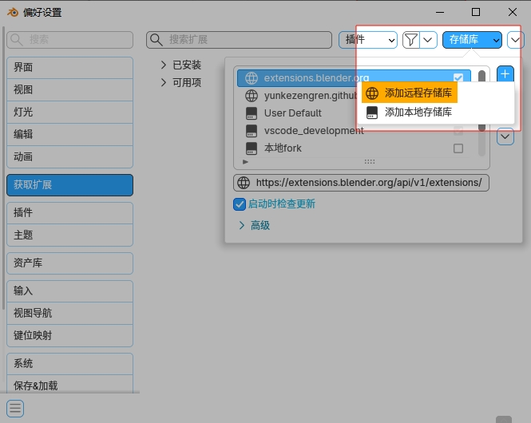
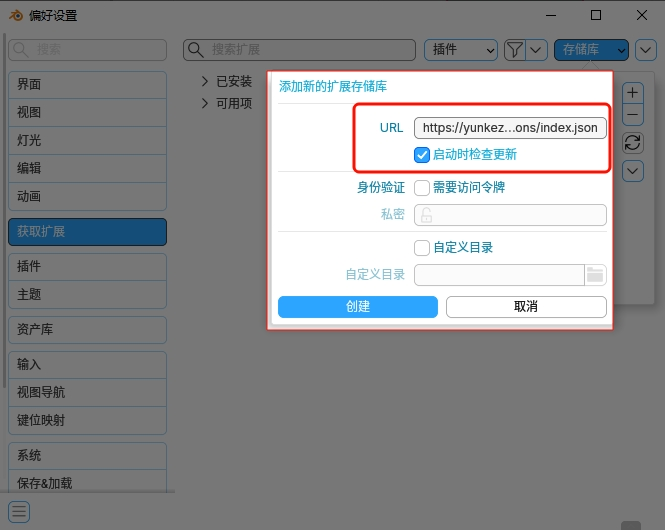
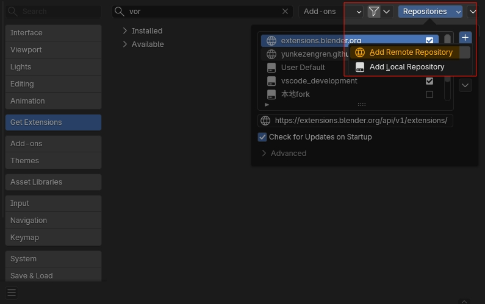
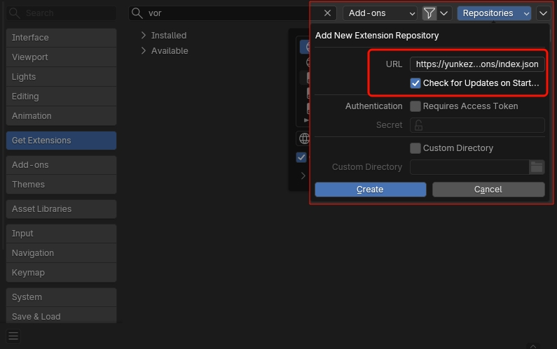

# 目录
- [中文简介](#中文简介)
- [English Description](#english-description)

# 简介

## VoronoiLinker

> [!IMPORTANT]
> **VoronoiLinker修改的是[neliut/VoronoiLinker](https://github.com/neliut/VoronoiLinker),只要我还用Blender,就会始终支持Blender最新版本**  
> 此外还拆分清理代码,并且增加了一些新功能  
> `Ctrl+Click`这个快捷键要搭配我修改的`node pie`插件(还没有上传github)才能用  

**支持添加远程存储库,在Blender偏好设置里下载更新.**  
**URL:** 
```
https://yunkezengren.github.io/extension_remote_repo/api/v1/extensions/index.json
```
|1.添加远程存储库|2.复制粘贴URL|
|--|--|
|  |  |

## Blender Extensions

> [!NOTE]
> - 这三个插件上传到了 [**Blender Extensions** @W_Cloud](https://extensions.blender.org/author/30/)
>   - **group_input_helper**
>   - **named_attribute_list**
>   - **node_align**
> - node_align / node_socket_location 有获取Blender接口精确位置的方法.
> - node_utilities 里面是几个有用的小插件.

---

# English Description

## VoronoiLinker

> [!IMPORTANT]
> **VoronoiLinker is a modification of [neliut/VoronoiLinker](https://github.com/neliut/VoronoiLinker).**  
> **As long as I continue using Blender, I will always support the latest version of Blender.**  
> Additionally, the code has been cleaned up and refactored, and some new features have been added.  
> The `Ctrl+Click` shortcut requires my modified `node pie` plugin (not yet uploaded to GitHub) to work.

**Support for adding remote repositories, download and update in Blender preferences.**  
**URL:** 
```
https://yunkezengren.github.io/extension_remote_repo/api/v1/extensions/index.json
```
|1.Add Remote Repository|2.Copy and Paste URL|
|--|--|
|  |  |

## Blender Extensions

> [!NOTE]
> - These three plugins have been uploaded to [Blender Extensions @W_Cloud](https://extensions.blender.org/author/30/)
>   - **group_input_helper**
>   - **named_attribute_list**
>   - **node_align**
> - node_align / node_socket_location has a method to get the exact position of Blender interfaces.
> - node_utilities contains several useful small plugins.
